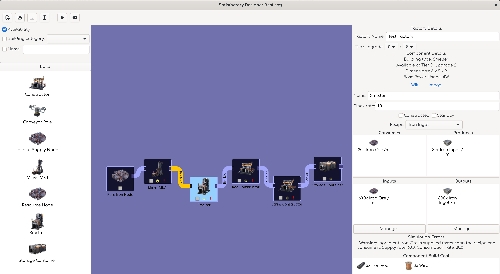

# factory_designer_gtk Module

## factory_designer_gtk Submodules

Most of this code surrounds how to take a `satisfactory.factory.Factory` and edit it in a GTK application. The code is heavily laden with GTK calls. I have relied heavily on a couple documents to guide this development:

- [Official GTK documentation](https://docs.gtk.org/gtk4/), which is written for the original C library, but which explains what the Python library is doing under the hood.
- [Gnome Python API documentation](https://amolenaar.pages.gitlab.gnome.org/pygobject-docs/#), which shows how the C library is mapped into a Python library.
- [Taiko2k's GTK4 Python Tutorial](https://github.com/Taiko2k/GTK4PythonTutorial), which does a great job of distilling common features of GTK4 down into something digestible.

### app

This handles the GTK Application, which integrates this application into your desktop of choice. It handles things like opening files from the command line, handling arguments, etc. This happens through the `FactoryDesigner` class.

### main_window

The `app` module mostly just invokes the `MainWindow` class from this module. This class handles the layout of the main window - the top bar, the three main panels, their widgets, and their signal handlers.

### dialogs

This module contains additional windows and such that pop up at times, such as the dialog that asks the user if they want to discard unsaved changes when they open a factory or start a new one without saving the existing one first.

### widgets

This contains the code defining any custom widgets we use. Right now, that's a custom widget for drawing the factory itself, a `FactoryDesignerWidget`. We also extend some widget classes into `Taggable` versions of the same, allowing us to pass arbitrary data into widget signal handlers.

### geometry

Here are defined all of the geometrical data types that get used when drawing components in the factory designer.

The simplest geometry primitives are:

- `Coordinate2D`: An `x` position describing the left-right location of something and a `y` position decribing its top-bottom location.
- `Size2D`: A `width` describing the left-right size of something and a `height` describing the top-bottom size.
- `Region2D`: A `Coordinate2D` and a `Size2D` combined, representing a rectangle.

There are also more complex arrangements of these primitives:

- `ComponentGeometry`: The full geometric measurings of a component as it is drawn on the screen, including the background, an icon, a label, badges, and an outline.
- `ConveyanceGeometry`: Contains the data used to draw conveyances. This is comprised of other constituent geometries.
- `ConveyanceTurnGeometry`: The geometry of a right-angle turn drawn as part of a conveyance.
- `ConveyanceTwoTurnGeometry`: The geometry used to draw a conveyance, consisting of two `ConveyanceTurnGeometry` objects and a path that connects them to an input and an output.

### drawing

This module contains all of the code necessary to draw images in the factory designer. The bulk of this module is the `Blueprint` class, which is responsible for drawing the entirety of a factory.

A `PangoTextLabel` is a class for working with text labels using the Pango text rendering library.

A `Viewport` represents the current view of the blueprint canvas. This is a region which can be panned around and zoomed in and out.

## Putting it all together

A `Blueprint` is a factory whose components are mapped to pixel coordinates on a canvas. At any given time, only a portion of that canvas is visible to the user through a `Viewport`. The `Viewport` is the same size as the `FactoryDesignerWidget`, which can be resized by the user by changing the size of the `MainWindow` or by resizing its various panels. The `Viewport` can also be dragged around and zoomed in and out to change the visible region of the canvas.

When a `Blueprint` is drawn, it takes these factors into consideration, drawing the portion of a factory that is visible within the `Viewport`. Very broadly speaking, the logic goes like this:

- What components are visible inside the Viewport?
- What components are not visible inside the Viewport, but are connected to components that are?
- Draw each component's icon.
- Draw any relevant badges for it (showing if it's been constructed, if there are errors on the component, etc.).
- Draw the component's name as a label beneath the badges.
- Determine what conveyances connect these.
- Draw those conveyances.